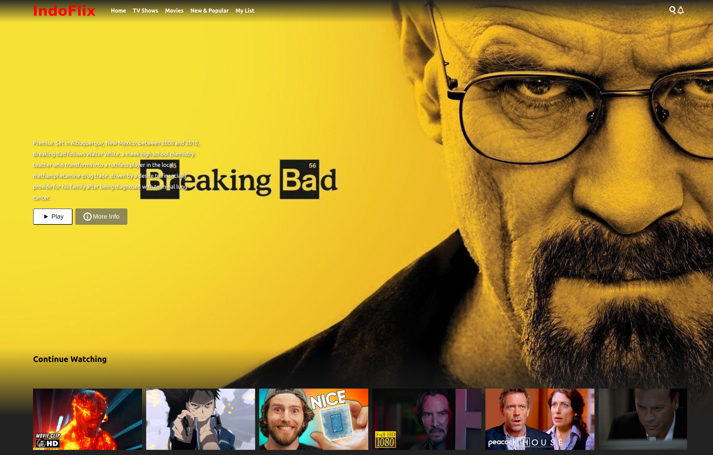

# Netflix homepage clone

This repo serves as demo for explaining TDD during Reactjs Indonesia meetup 2022.

To start:
- clone this repo (ssh)
`git clone git@github.com:krowter/tdd-netflix-homepage-clone.git`
or (https)
`git clone https://github.com/krowter/tdd-netflix-homepage-clone.git`

- install dependencies
`yarn`

- for development
`yarn dev`

- for production
`yarn build`

## Built with

React, Vitest, React Testing Library, CSS Modules